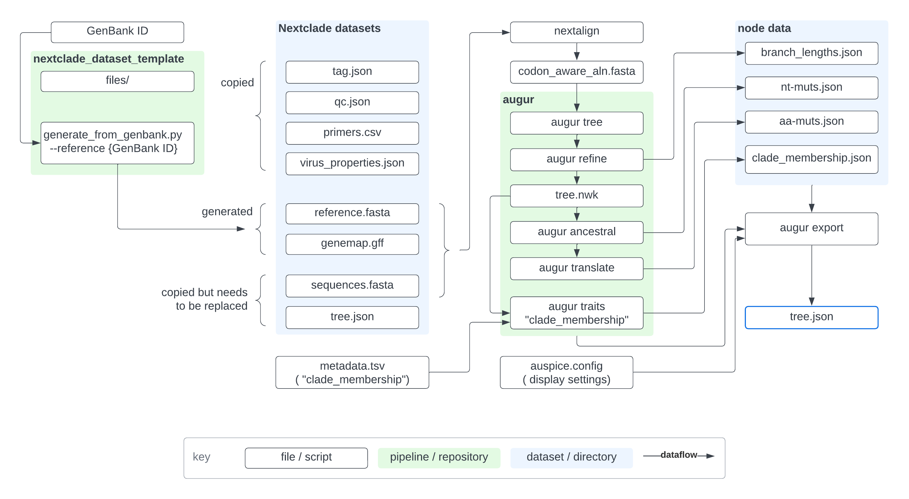

# nextclade_dengue

Attempt to create a nextclade_dengue dataset

## Potential References

Identify potential references based on files listed in the config folder.

* https://github.com/nextstrain/dengue/tree/main/config

| clade_membership | accession | strain | Nextclade Web |
|:--|:--|:--|:--|
| | [NC_002640](https://www.ncbi.nlm.nih.gov/nuccore/NC_002640) | DENV4/NA/REFERENCE/2003 (DENV4)| [Nextclade all](https://clades.nextstrain.org/?dataset-url=https://github.com/j23414/nextclade_dengue/tree/main/all) |
| DENV1 | [NC_001477](https://www.ncbi.nlm.nih.gov/nuccore/NC_001477) | DENV1/NAURUISLAND/REFERENCE/1997 | [Nextclade denv1](https://clades.nextstrain.org/?dataset-url=https://github.com/j23414/nextclade_dengue/tree/main/denv1) |
| DENV2 | [NC_001474](https://www.ncbi.nlm.nih.gov/nuccore/NC_001474) | DENV2/THAILAND/REFERENCE/1964 | [Nextclade denv2](https://clades.nextstrain.org/?dataset-url=https://github.com/j23414/nextclade_dengue/tree/main/denv2) |
| DENV3 | [NC_001475](https://www.ncbi.nlm.nih.gov/nuccore/NC_001475) | DENV3/SRI_LANKA/REFERENCE/2000 | [Nextclade denv3](https://clades.nextstrain.org/?dataset-url=https://github.com/j23414/nextclade_dengue/tree/main/denv3) |
| DENV4 | [NC_002640](https://www.ncbi.nlm.nih.gov/nuccore/NC_002640) | DENV4/NA/REFERENCE/2003 | [Nextclade denv4](https://clades.nextstrain.org/?dataset-url=https://github.com/j23414/nextclade_dengue/tree/main/denv4) |