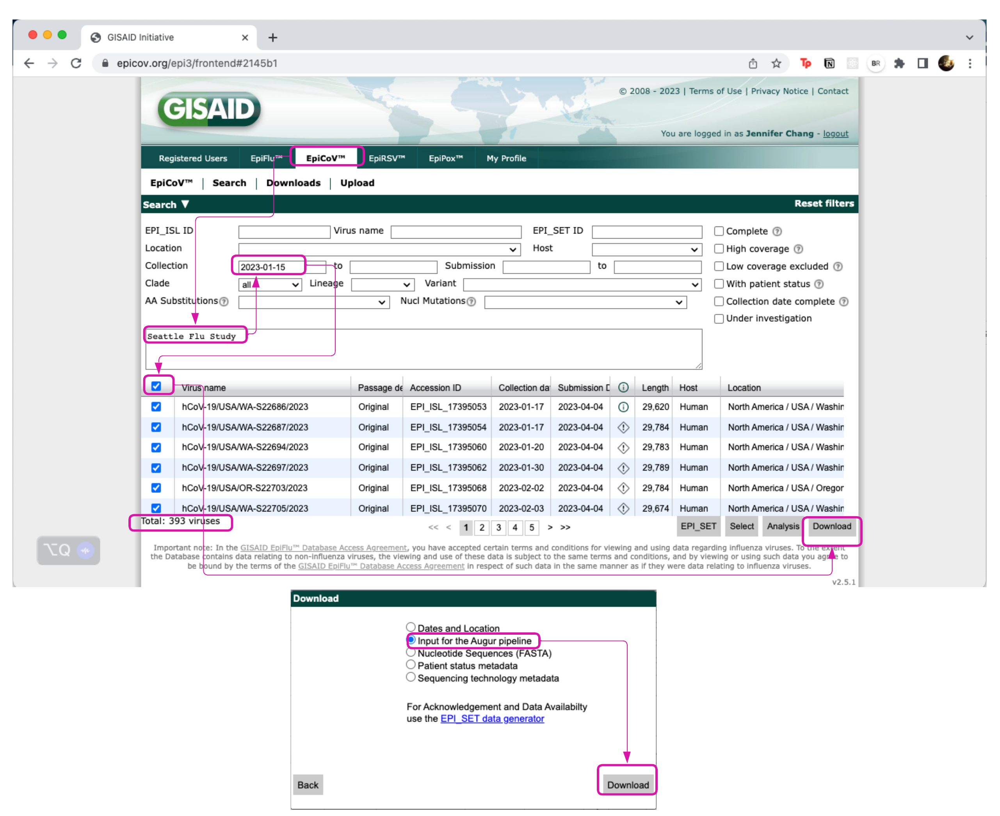
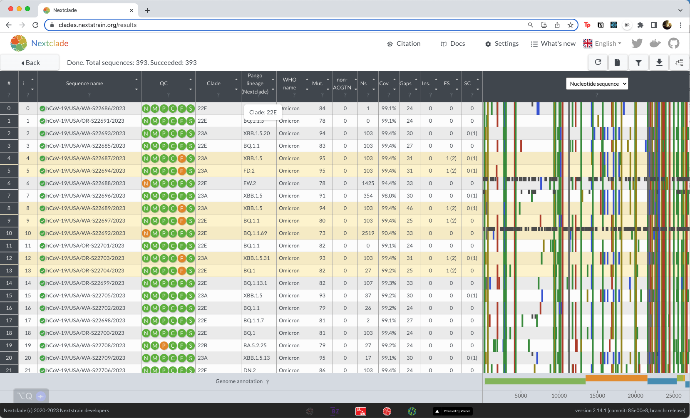
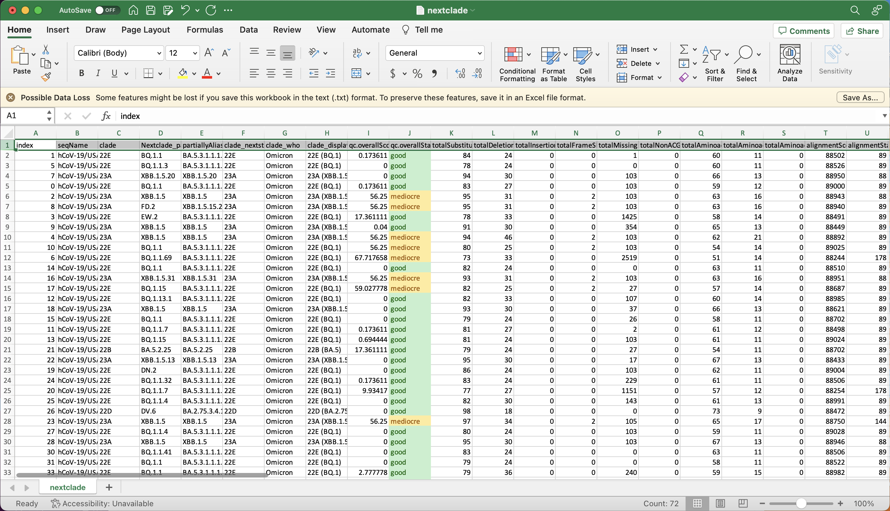

# Demo

1. Download ~400 recent samples from SFS (Seattle Flu Study) or WA DOH from gisaid

  
  
```
export INPUT_TAR=gisaid_auspice_input_hcov-19_2023_06_27_18.tar
tar -xvf $INPUT_TAR
export INPUT_METADATA=1687891060186.metadata.tsv
export INPUT_FASTA=1687891060186.sequences.fasta
```

2. Download Nextclade pathogen dataset

  ```
  nextclade dataset get \
  --name 'sars-cov-2' \
  --output-dir 'data/sars-cov-2' \
  --verbose
  ```

  ```
  ls -ltr data/sars-cov-2 
  #> total 5.9M
  #>  username staff 2.1M tree.json
  #>  username staff 3.7M sequences.fasta
  #>  username staff  30K reference.fasta
  #>  username staff 1021 genemap.gff
  #>  username staff  889 tag.json
  #>  username staff  27K qc.json
  #>  username staff 2.3K primers.csv
  #>  username staff  49K virus_properties.json
  ```
  
3. Run Nextclade on input fasta file

  ```
  nextclade run \
   --input-dataset data/sars-cov-2 \
   --output-all=output/ \
   $INPUT_FASTA 
  ```

  ```
  ls -ltr output 
  #> total 150M
  #> -rw-r--r-- 1 user staff  12M nextclade.aligned.fasta
  #> -rw-r--r-- 1 user staff  41K nextclade_gene_E.translation.fasta
  #> -rw-r--r-- 1 user staff  97K nextclade_gene_M.translation.fasta
  #> -rw-r--r-- 1 user staff 173K nextclade_gene_N.translation.fasta
  #> -rw-r--r-- 1 user staff 1.7M nextclade_gene_ORF1a.translation.fasta
  #> -rw-r--r-- 1 user staff 1.1M nextclade_gene_ORF1b.translation.fasta
  #> -rw-r--r-- 1 user staff 118K nextclade_gene_ORF3a.translation.fasta
  #> -rw-r--r-- 1 user staff  35K nextclade_gene_ORF6.translation.fasta
  #> -rw-r--r-- 1 user staff  58K nextclade_gene_ORF7a.translation.fasta
  #> -rw-r--r-- 1 user staff  29K nextclade_gene_ORF7b.translation.fasta
  #> -rw-r--r-- 1 user staff  58K nextclade_gene_ORF8.translation.fasta
  #> -rw-r--r-- 1 user staff  49K nextclade_gene_ORF9b.translation.fasta
  #> -rw-r--r-- 1 user staff 501K nextclade_gene_S.translation.fasta
  #> -rw-r--r-- 1 user staff  81M nextclade.json
  #> -rw-r--r-- 1 user staff  37M nextclade.ndjson
  #> -rw-r--r-- 1 user staff 804K nextclade.csv
  #> -rw-r--r-- 1 user staff 803K nextclade.tsv
  #> -rw-r--r-- 1 user staff  12K nextclade.insertions.csv
  #> -rw-r--r-- 1 user staff  12K nextclade.errors.csv
  #> -rw-r--r-- 1 user staff  14M nextclade.auspice.json
  ```
  
4. View results

  Can view the nextstrain tree

  ```
  nextstrain view output
  ```

  
  
  Or drag sequences.fasta onto [Nextclade Web](https://clades.nextstrain.org/).
  
  

5. Interpret QC values

  * https://docs.nextstrain.org/projects/nextclade/en/stable/user/algorithm/06-quality-control.html
  * Interpreting TSV results - https://docs.nextstrain.org/projects/nextclade/en/stable/user/output-files.html#tabular-csv-tsv-results

  

### Check QC Score calculations

For a written description of each quality score, visit

* https://docs.nextstrain.org/projects/nextclade/en/stable/user/algorithm/07-quality-control.html#quality-scores

| Score | Meaning | Color designation |
|:--|:--|:--|
| 0 to 29 | "good" quality | green |
| 30 to 99 | "mediocre" quality | yellow |
| 100 and above | "bad" quality | red |

#### Missing Data (N)

$$
\begin{align*}
N_{count} &= \{ 0 .. \text{length of sequence}\} \\
QC_{N} &= max(0, ((N_{count}-300) * 100/2700))
\end{align*}
$$

The source code calculating missing data is in [qc_rule_missing_data.rs](https://github.com/nextstrain/nextclade/blob/master/packages_rs/nextclade/src/qc/qc_rule_missing_data.rs#L26-L29) 

```
let score = clamp_min(
  ((total_missing as f64 - config.score_bias) * 100.0) / config.missing_data_threshold,
  0.0,
);
```

where `score_bias=300` and `missing_data_threshold=2700` in the [qc.json file](https://github.com/nextstrain/nextclade_data/blob/master/data/datasets/sars-cov-2/references/MN908947/versions/2021-06-25T00%3A00%3A00Z/files/qc.json#L8-L12).

```
"missingData": {
  "enabled": true,
  "missingDataThreshold": 2700,
  "scoreBias": 300
},
```

Example:

```
>reference
GGGGGGGGGGGGGGGGGGGGGGGGGGGGGGGGGGGGGGGGGG
>query_sample
NNNNNNNNNNNNNGGGGGGGGGGGGGGGGGGGGGGGGGGGGG
```

$N_{count}=13$

$QC_{N}=max(0, 13-300) * 100/2700 = 0 = \text{good}$


Questions:

* Is missing data including gaps `-` in the alignment as well as `N`'s?
* Only the region that aligns to the reference is penalized, ignore overhangs?

----

#### Mixed sites (M)

$$
\begin{align*}
M_{count} &= \text{ambiguious nucleotides, not ACGT} \\
QC_{M}&= M_{count} * 100/10
\end{align*}
$$

The source code calculating mixed sites is in [qc_rule_mixed_sites.rs](https://github.com/nextstrain/nextclade/blob/242d56fbd8d8af67df3157bd047252f5580e3df8/packages_rs/nextclade/src/qc/qc_rule_mixed_sites.rs#L39-L42) 

```
let score = clamp_min(
  100.0 * (total_mixed_sites as f64 / config.mixed_sites_threshold as f64),
  0.0,
);
```

where `mixedSiteThreshold=10` in the [qc.json file](https://github.com/nextstrain/nextclade_data/blob/master/data/datasets/sars-cov-2/references/MN908947/versions/2021-06-25T00%3A00%3A00Z/files/qc.json#L19C1-L22C5)

```
"mixedSites": {
  "enabled": true,
  "mixedSitesThreshold": 10
},
```

-----

#### Private mutations (P)

$$
\begin{align*}
P_{count} &= P_{reversions} + P_{labeled} + P_{unlabeled} \\
QC_{P} &= max(0, (6 * P_{reversions} + 4 * P_{labeled} + 1 * P_{unlabeled} - 8)) * 100/24
\end{align*}
$$

The source code calculating private mutations is in [qc_rule_private_mutations.rs](https://github.com/nextstrain/nextclade/blob/242d56fbd8d8af67df3157bd047252f5580e3df8/packages_rs/nextclade/src/qc/qc_rule_private_mutations.rs#L46-L53) 

```
let weighted_total = 0.0
  + config.weight_reversion_substitutions * num_reversion_substitutions as f64
  + config.weight_labeled_substitutions * num_labeled_substitutions as f64
  + config.weight_unlabeled_substitutions * num_unlabeled_substitutions as f64
  + total_deletion_ranges as f64;
// the score hits 100 if the excess mutations equals the cutoff value
let score = (clamp_min(weighted_total - config.typical, 0.0) * 100.0) / config.cutoff;
```

where `typical=8` and `cutoff=24` in the [qc.json file](https://github.com/nextstrain/nextclade_data/blob/abfd2a8de48f6005ef24e897e568660e8d6ac5c9/data/datasets/sars-cov-2/references/MN908947/versions/2021-06-25T00%3A00%3A00Z/files/qc.json#L3-L7).

```
"privateMutations": {
  "enabled": true,
  "typical": 8,
  "cutoff": 24
},
```

example:

```
>reference
GGGGGGGGGGGGGGGGGGGGGGGGGGGGGGGGGGGGGGGGGG
>clade_A
AAAAAAAGGGGGGGGGGGGGGGGGGGGGGGGGGGGGGGGGGG
>clade_T
TTTTTTTGGGGGGGGGGGGGGGGGGGGGGGGGGGGGGGGGGG
>query_sample
TAGGTTTGGGGGGGGGGGGGGGGGGGGGGGGGGGGGGGGCCG
```

$$
\begin{align*}
P_{reversions} &= 2 \text{ G reversions to reference} \\
P_{labeled} &= 4 \text{ T labeled mutations to clade T} \\
P_{unlabeled} & = 1 \text{ A unlabeled mutations} + 2 \text{ C unlabeled mutations}\\
P_{count} &= 2 + 4 + 3  \\
QC_{P} &= max(0, (6 * 2 + 4 * 4 + 1 * 3 - 8)) * 100/24 = 95.83 = \text{mediocre}
\end{align*}
$$

---

#### Mutation clusters (C)

The source code calculating mutation clusters is in [qc_rule_snp_clusters.rs](https://github.com/nextstrain/nextclade/blob/242d56fbd8d8af67df3157bd047252f5580e3df8/packages_rs/nextclade/src/qc/qc_rule_snp_clusters.rs#L45-L55)

```
let mut snp_clusters = find_snp_clusters(&private_nuc_mutations.private_substitutions, config);
for cluster in &mut snp_clusters {
  cluster.sort_unstable();
}
let total_clusters = snp_clusters.len();
let clustered_snps = process_snp_clusters(snp_clusters);
let total_snps = clustered_snps.iter().map(|cluster| cluster.number_of_snps).sum();
let score = clamp_min(total_clusters as f64 * config.score_weight, 0.0);
```

where `windowSize=100`, `clusterCutOff=6`, and `scoreWeight=50` in the [qc.json file](https://github.com/nextstrain/nextclade_data/blob/abfd2a8de48f6005ef24e897e568660e8d6ac5c9/data/datasets/sars-cov-2/references/MN908947/versions/2021-06-25T00%3A00%3A00Z/files/qc.json#L13C1-L18C5)

```
"snpClusters": {
  "enabled": true,
  "windowSize": 100,
  "clusterCutOff": 6,
  "scoreWeight": 50
},
```

---

#### Stop codons (S)

$$
\begin{align*}
QC_{S} = (S_{count} - \text{known stop codons}) * 75
\end{align*}
$$

The source code calculating private data is in [qc_rule_private_mutations.rs](https://github.com/nextstrain/nextclade/blob/242d56fbd8d8af67df3157bd047252f5580e3df8/packages_rs/nextclade/src/qc/qc_rule_stop_codons.rs#L42-L62) 

```
let len_minus_one = peptide.len() - 1; // Minus one to ignore valid stop codon at the end
for (codon, aa) in peptide.iter().enumerate().take(len_minus_one) {
  if aa.is_stop() {
    let stop_codon = StopCodonLocation {
      gene_name: gene_name.clone(),
      codon,
    }
    if is_ignored_stop_codon(&stop_codon, &config.ignored_stop_codons) {
      stop_codons_ignored.push(stop_codon);
    } else {
      stop_codons.push(stop_codon);
    }
  }
}
```

where two known stop codons are listed in the [qc.json file](https://github.com/nextstrain/nextclade_data/blob/abfd2a8de48f6005ef24e897e568660e8d6ac5c9/data/datasets/sars-cov-2/references/MN908947/versions/2021-06-25T00%3A00%3A00Z/files/qc.json#L26-L32).

```
"stopCodons": {
    "enabled": true,
    "ignoredStopCodons": [
      {"geneName": "ORF8", "codon": 26},
      {"geneName": "ORF8", "codon": 67}
    ]
}
```
---

#### Frame shifts (F)

$$
\begin{align*}
QC_{F} = (F_{count} - \text{ignored known frame shifts}) * 75
\end{align*}
$$

The source code calculating frameshift is in [qc_rule_frame_shifts.rs](https://github.com/nextstrain/nextclade/blob/242d56fbd8d8af67df3157bd047252f5580e3df8/packages_rs/nextclade/src/qc/qc_rule_frame_shifts.rs#L40-L48)

```
let (frame_shifts_ignored, frame_shifts): (Vec<FrameShift>, Vec<FrameShift>) = all_frame_shifts
  .iter()
  .cloned()
  .partition(|frame_shift| is_frame_shift_ignored(frame_shift, config));
let total_frame_shifts = frame_shifts.len();
let total_frame_shifts_ignored = frame_shifts_ignored.len();
let score = total_frame_shifts as f64 * config.score_weight;
```

where no known frameshifts are listed in the [qc.json file](https://github.com/nextstrain/nextclade_data/blob/abfd2a8de48f6005ef24e897e568660e8d6ac5c9/data/datasets/sars-cov-2/references/MN908947/versions/2021-06-25T00%3A00%3A00Z/files/qc.json#L23-L25)

```
  "frameShifts": {
    "enabled": true
  },
```

---

6. Interpret SNP plot

  * https://docs.nextstrain.org/projects/nextclade/en/stable/user/algorithm/03-mutation-calling.html

7. Interpret phylogenetic tree

  * https://docs.nextstrain.org/projects/nextclade/en/stable/user/algorithm/05-phylogenetic-placement.html
  * https://next.nextstrain.org/narratives/trees-background

## References

* Aksamentov, I., Roemer, C., Hodcroft, E. B., & Neher, R. A., (2021). Nextclade: clade assignment, mutation calling and quality control for viral genomes. Journal of Open Source Software, 6(67), 3773, https://doi.org/10.21105/joss.03773
* https://docs.nextstrain.org/projects/nextclade/en/stable/user/nextclade-cli.html
