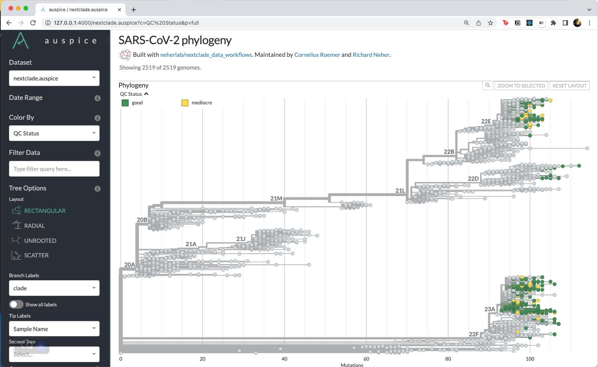

# Demo

1. Download ~400 recent samples from SFS (Seattle Flu Study) or WA DOH from gisaid

  
  
```
export INPUT_TAR=gisaid_auspice_input_hcov-19_2023_06_27_18.tar
tar -xvf $INPUT_TAR
export INPUT_METADATA=1687891060186.metadata.tsv
export INPUT_FASTA=1687891060186.sequences.fasta
```

2. Download Nextclade pathogen dataset

  ```
  nextclade dataset get \
  --name 'sars-cov-2' \
  --output-dir 'data/sars-cov-2' \
  --verbose
  ```

  ```
  ls -ltr data/sars-cov-2 
  #> total 5.9M
  #>  username staff 2.1M tree.json
  #>  username staff 3.7M sequences.fasta
  #>  username staff  30K reference.fasta
  #>  username staff 1021 genemap.gff
  #>  username staff  889 tag.json
  #>  username staff  27K qc.json
  #>  username staff 2.3K primers.csv
  #>  username staff  49K virus_properties.json
  ```
  
3. Run Nextclade on input fasta file

  ```
  nextclade run \
   --input-dataset data/sars-cov-2 \
   --output-all=output/ \
   $INPUT_FASTA 
  ```

  ```
  ls -ltr output 
  #> total 150M
  #> -rw-r--r-- 1 user staff  12M nextclade.aligned.fasta
  #> -rw-r--r-- 1 user staff  41K nextclade_gene_E.translation.fasta
  #> -rw-r--r-- 1 user staff  97K nextclade_gene_M.translation.fasta
  #> -rw-r--r-- 1 user staff 173K nextclade_gene_N.translation.fasta
  #> -rw-r--r-- 1 user staff 1.7M nextclade_gene_ORF1a.translation.fasta
  #> -rw-r--r-- 1 user staff 1.1M nextclade_gene_ORF1b.translation.fasta
  #> -rw-r--r-- 1 user staff 118K nextclade_gene_ORF3a.translation.fasta
  #> -rw-r--r-- 1 user staff  35K nextclade_gene_ORF6.translation.fasta
  #> -rw-r--r-- 1 user staff  58K nextclade_gene_ORF7a.translation.fasta
  #> -rw-r--r-- 1 user staff  29K nextclade_gene_ORF7b.translation.fasta
  #> -rw-r--r-- 1 user staff  58K nextclade_gene_ORF8.translation.fasta
  #> -rw-r--r-- 1 user staff  49K nextclade_gene_ORF9b.translation.fasta
  #> -rw-r--r-- 1 user staff 501K nextclade_gene_S.translation.fasta
  #> -rw-r--r-- 1 user staff  81M nextclade.json
  #> -rw-r--r-- 1 user staff  37M nextclade.ndjson
  #> -rw-r--r-- 1 user staff 804K nextclade.csv
  #> -rw-r--r-- 1 user staff 803K nextclade.tsv
  #> -rw-r--r-- 1 user staff  12K nextclade.insertions.csv
  #> -rw-r--r-- 1 user staff  12K nextclade.errors.csv
  #> -rw-r--r-- 1 user staff  14M nextclade.auspice.json
  ```
  
4. View results

  Can view the nextstrain tree

  ```
  nextstrain view output
  ```

  
  
  Or drag sequences.fasta onto [Nextclade Web](https://clades.nextstrain.org/).
  
  

5. Interpret QC values

  * https://docs.nextstrain.org/projects/nextclade/en/stable/user/algorithm/07-quality-control.html
  * Interpreting TSV results - https://docs.nextstrain.org/projects/nextclade/en/stable/user/output-files.html#tabular-csv-tsv-results

  

### Check QC Score calculations

#### Missing Data (N)

$$
\begin{align*}
N_{count} &= \{ 0 .. \text{length of sequence}\} \\
QC_{N} &= max(0, ((N_{count}-300) * 100/2700))
\end{align*}
$$

The source code calculating missing data is in [qc_rule_missing_data.rs](https://github.com/nextstrain/nextclade/blob/master/packages_rs/nextclade/src/qc/qc_rule_missing_data.rs#L26-L29) 

```
let score = clamp_min(
  ((total_missing as f64 - config.score_bias) * 100.0) / config.missing_data_threshold,
  0.0,
);
```

where `score_bias=300` and `missing_data_threshold=2700` in the [qc.json file](https://github.com/nextstrain/nextclade_data/blob/master/data/datasets/sars-cov-2/references/MN908947/versions/2021-06-25T00%3A00%3A00Z/files/qc.json#L8-L12).

```
"missingData": {
  "enabled": true,
  "missingDataThreshold": 2700,
  "scoreBias": 300
},
```

Example:

```
>reference
GGGGGGGGGGGGGGGGGGGGGGGGGGGGGGGGGGGGGGGGGG
>query_sample
NNNNNNNNNNNNNGGGGGGGGGGGGGGGGGGGGGGGGGGGGG
```

$N_{count}=13$

$QC_{N}=max(0, 13-300) * 100/2700 = 0 = \text{good}$

----

#### Mixed sites (M)

$$
\begin{align*}
M_{count} &= \text{ambiguious nucleotides, not ACGT} \\
QC_{M}&= M_{count} * 100/10
\end{align*}
$$


-----

**P** Private mutations

$$
\begin{align*}
P_{count} &= P_{reversions} + P_{labeled} + P_{unlabeled} \\
QC_{P} &= max(0, (6 * P_{reversions} + 4 * P_{labeled} + 1 * P_{unlabeled} - 8)) * 100/24
\end{align*}
$$

example:

```
>reference
GGGGGGGGGGGGGGGGGGGGGGGGGGGGGGGGGGGGGGGGGG
>clade_A
AAAAAAAGGGGGGGGGGGGGGGGGGGGGGGGGGGGGGGGGGG
>clade_T
TTTTTTTGGGGGGGGGGGGGGGGGGGGGGGGGGGGGGGGGGG
>query_sample
TAGGTTTGGGGGGGGGGGGGGGGGGGGGGGGGGGGGGGGCCG
```

$$
\begin{align*}
P_{reversions} &= 2 \text{ G reversions to reference} \\
P_{labeled} &= 4 \text{ T labeled mutations to clade T} \\
P_{unlabeled} & = 1 \text{ A unlabeled mutations} + 2 \text{ C unlabeled mutations}\\
P_{count} &= 2 + 4 + 3  \\
QC_{P} &= max(0, (6 * 2 + 4 * 4 + 1 * 3 - 8)) * 100/24 = 95.83 = \text{mediocre}
\end{align*}
$$

**C** Mutation clusters

**S** Stop codons

$$
\begin{align*}
QC_{S} = (S_{count} - \text{known stop codons}) * 75
\end{align*}
$$

**F** Frame shifts

$$
\begin{align*}
QC_{F} = (F_{count} - \text{ignored known frame shifts}) * 75
\end{align*}
$$

An example known frame-shift are the alpha deletions in H3N2. 

6. Interpret SNP plot

  * Nucleotide plot to the right?
  * Or [SNP clusters](https://docs.nextstrain.org/projects/nextclade/en/stable/user/algorithm/07-quality-control.html?highlight=SNP#mutation-clusters-c)

7. Interpret phylogenetic tree

  * https://docs.nextstrain.org/projects/nextclade/en/stable/user/algorithm/05-phylogenetic-placement.html
  * https://next.nextstrain.org/narratives/trees-background

## References

* Aksamentov, I., Roemer, C., Hodcroft, E. B., & Neher, R. A., (2021). Nextclade: clade assignment, mutation calling and quality control for viral genomes. Journal of Open Source Software, 6(67), 3773, https://doi.org/10.21105/joss.03773
* https://docs.nextstrain.org/projects/nextclade/en/stable/user/nextclade-cli.html